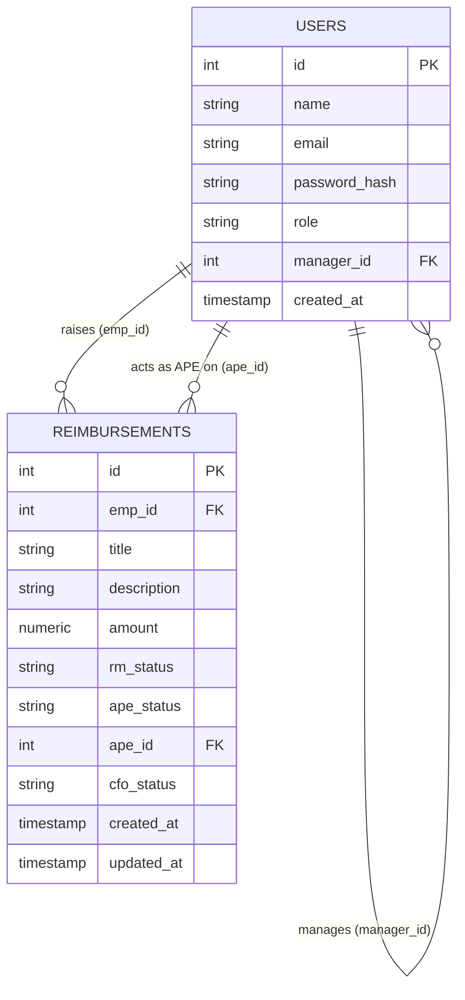

# Master Build Prompt — Reimbursements RBAC Backend (Razorpay Pre-Assignment)

> **This file lives in the repo root, permanently.** Commit it in Phase 1 and never
> delete or move it — it's the spec and plan the grader needs to follow how the project
> was built, and it's what you hand to your AI coding assistant at the start of every
> session so it has full context without you re-explaining the project each time.

## What we're building

A backend for a reimbursements tool used inside one organization. Employees raise
expense claims; those claims move through an approval chain (their manager, then an
accounts-payable person, then visibility for the CFO) before money goes out. The actual
product here is **role-based access control** — four roles (`EMP`, `RM`, `APE`, `CFO`),
each seeing a different slice of the data and allowed a different set of actions. The
code itself (auth, CRUD, a status pipeline) is simple; the value is in modeling the
roles and permissions cleanly enough that adding a fifth role later wouldn't require
rewriting half the app.

We are optimizing for **a project that's easy to read and extend, not a clever one.**
Plain Express.js, plain JavaScript (no TypeScript), straightforward SQL — readability and
correctness over performance tricks or abstraction for its own sake.

---

## 0. Hard constraints (non-negotiable — repeat these to your AI assistant verbatim)

- **Language: plain JavaScript only.** No TypeScript, no build step.
- **Framework: Express.js.**
- **Database: PostgreSQL.**
- **Node version: >= 20.10.2.**
- `dev` script starts the server **strictly on port 7002**.
- `db:migrate` and `db:seed-data` must run cleanly on a fresh machine, no manual steps.
- `db:seed-data` seeds **only** the CFO account, nothing else:
  - email: `cfo@org.com`
  - password: `CFO#ORG@April2026`
- All routes prefixed with `/rest`.
- Auth is **cookie-based** — login sets a cookie, protected routes read it automatically.
- Endpoint paths, request bodies, and response shapes must match the spec **exactly** —
  the automated tester is brittle by design. Don't rename fields, don't change nesting.
- Code should be **well-structured, not over-optimized**: favor obvious file
  organization, small single-purpose functions, and SQL you can read in five seconds
  over query-builder cleverness or premature caching/indexing.

---

## 1. Schema (design this first, before any code)



*(GitHub renders this block automatically. If your AI tool can't read mermaid, the table
form is below.)*

### `users`
| column | type | notes |
|---|---|---|
| id | serial/uuid PK | |
| name | text | |
| email | text, unique | must end in `@org.com` |
| password_hash | text | bcrypt — never store plaintext |
| role | text/enum | `EMP` / `RM` / `APE` / `CFO`, defaults to `EMP` on self-registration |
| manager_id | FK -> users.id, nullable | the RM this EMP reports to; null for non-EMPs and unassigned EMPs |
| created_at | timestamp | |

**Why a `manager_id` column instead of a join table:** the spec says every employee
reports to *exactly one* RM — a 1:1-per-employee relationship, not many-to-many. A
nullable self-referencing FK is the simplest correct model and maps directly onto
`POST /rest/employees/assign` (set it) and `DELETE /rest/employees/assign` (null it).

### `reimbursements`
| column | type | notes |
|---|---|---|
| id | serial/uuid PK | |
| emp_id | FK -> users.id | the raising employee |
| title | text | |
| description | text | |
| amount | numeric | |
| rm_status | text/enum | `PENDING` / `APPROVED` / `REJECTED`, default `PENDING` |
| ape_status | text/enum | same, default `PENDING` |
| ape_id | FK -> users.id, nullable | which APE acted, once one does |
| cfo_status | text/enum | same, default `PENDING` |
| created_at / updated_at | timestamp | |

**Why three status columns instead of one:** the spec describes a *pipeline*, not a flag
— "PENDING from their EMPs" (RM stage), "PENDING at the APE level but already APPROVED by
the RM" (APE stage), "already APPROVED by the APEs" (CFO stage). One column can't hold
"approved at stage 1, pending at stage 2" at the same time, and the four different
`GET /rest/reimbursements` visibility rules each need that distinction.

**EMP-facing status** is *derived* from the three columns, not stored separately (single
source of truth):
- `REJECTED` if `rm_status = REJECTED` OR `ape_status = REJECTED`
- `APPROVED` if `rm_status = APPROVED` AND `ape_status = APPROVED` (per the spec's "RM
  **and** one of the APEs" rule — the CFO stage is a downstream audit step that doesn't
  change what the EMP sees)
- `PENDING` otherwise

**Visibility queries by role** (`GET /rest/reimbursements`):
- `EMP` → `WHERE emp_id = :selfId`
- `RM` → `WHERE emp.manager_id = :rmId AND rm_status = 'PENDING'`
- `APE` → `WHERE rm_status = 'APPROVED' AND ape_status = 'PENDING'`
- `CFO` → `WHERE ape_status = 'APPROVED'`

> Double-check this against the PDF before coding: the "EMP not allowed" line belongs to
> `GET /rest/employees`, **not** `GET /rest/reimbursements` (which separately says "EMP —
> lists their own"). Don't conflate the two tables.

---

## 2. Architecture (SOLID, layered, boring on purpose)

```
src/
  config/          # db pool, env loading
  db/
    migrations/    # raw SQL or knex/sequelize migrations — must be runnable via db:migrate
    seed/          # db:seed-data script — CFO only
  modules/
    auth/           # register, login, logout — controller, service, repository
    roles/          # role assignment
    employees/      # listing + manager assignment
    reimbursements/ # create, patch, list, list-by-user
  middleware/
    authenticate.js # reads cookie, attaches req.user
    authorize.js    # role-based guard, takes allowed roles as config, not hardcoded per-route
  utils/
    errors.js       # AppError classes, central error shape
    asyncHandler.js
  app.js            # express app wiring
  server.js          # listens on port 7002
```

Each module owns one bounded context (single responsibility per controller / service /
repository). `authorize.js` takes a list of permitted roles so routes declare *policy*,
not *logic* — adding a role later means editing a config array, not branching code in
five places. Repositories isolate raw SQL so query changes don't touch controllers.

---

## 3. How we work — phases with a review gate after each one

The work is split into **4 feature-wise phases**. After finishing a phase, the AI
assistant must **stop and wait for your explicit go-ahead** before starting the next
one — it should not silently roll on. You review the diff, test it manually, then say
something like *"approved, move to phase 2"*. Once approved, **commit** (one commit, or
a small tidy cluster of commits, per phase) before moving on. This is what gives you the
clean, reviewable commit history the assignment asks for — one commit boundary per
feature, not per file edit.

**Instruction to paste at the top of every session with your AI tool:**
> Work only on the current phase below. When the phase is complete, stop, summarize what
> you built and how you tested it, and explicitly wait for my approval before starting
> the next phase. Do not begin the next phase on your own. Use plain JavaScript and
> Express.js only — no TypeScript. Keep the code simple and readable over clever; this
> project is graded on structure, not performance. Keep `prompt.md` and `checkpoint.md`
> in the repo root and update `prompt-logs.txt` with every prompt I send you, appended
> after each phase, not all at once at the end.

### Phase 1 — Foundation, schema, and auth
**Goal:** a runnable skeleton with real authentication.
- `package.json` with working `dev`, `db:migrate`, `db:seed-data` scripts.
- Migrations for `users` and `reimbursements` per the schema in section 1.
- `db:seed-data` creates the CFO row only, idempotently (`ON CONFLICT DO NOTHING` or
  check-then-insert — running it twice must not crash or duplicate).
- `POST /rest/onboardings/register` — org.com domain check, bcrypt hash, default role `EMP`.
- `POST /rest/onboardings/login` — cookie issuance.
- `POST /rest/onboardings/logout` — cookie clear.
- `authenticate` middleware that reads the cookie and attaches `req.user`.
- Commit `prompt.md` itself into the repo as part of this phase.
- **Stop here.** Manually test register/login/logout with curl or Postman before approving.

### Phase 2 — Roles and organization structure
**Goal:** the CFO can shape the org chart.
- `authorize` middleware (role-list based).
- `POST /rest/roles/assign` — CFO-only, validates `userId` exists and `role` is one of
  the four valid strings.
- `GET /rest/employees` — role-scoped per the spec table (EMP blocked, RM sees own
  reports, APE sees EMPs+RMs, CFO sees everyone).
- `POST /rest/employees/assign` / `DELETE /rest/employees/assign` — CFO-only, validate
  the target IDs actually have role EMP and RM respectively before linking/unlinking.
- **Stop here.** Manually verify role assignment and the four different `/rest/employees`
  views before approving.

### Phase 3 — Reimbursement lifecycle (write side)
**Goal:** employees can raise claims; the approval chain can act on them.
- `POST /rest/reimbursements` — EMP-only, creates with `rm_status/ape_status/cfo_status
  = PENDING`.
- `PATCH /rest/reimbursements` — RM/APE/CFO can approve or reject, but only at their own
  stage, and only on reimbursements they're actually allowed to touch (an RM should only
  act on their own reports' claims, not anyone's).
- Derived EMP-facing status logic (section 1) implemented as a small, named function —
  not inlined in three places.
- **Stop here.** Walk one reimbursement through the full pipeline manually (raise →
  RM approves → APE approves → confirm EMP sees `APPROVED`) before approving.

### Phase 4 — Reimbursement visibility and edge cases
**Goal:** every role's read view is correct, and the unhappy paths are handled.
- `GET /rest/reimbursements` — all four role-scoped queries from section 1.
- `GET /rest/reimbursements/<user-id>` — only if target is an EMP and is the requester's
  subordinate.
- Edge-case pass (full checklist below) — its own reviewable commit, deliberately
  separate from the happy-path commit.
- Final README: design decisions, assumptions, setup instructions.
- **Stop here.** This is the last phase — review everything once more before final commit.

---

## 4. Checkpoint strategy — `checkpoint.md`

Separate from the phase commits above, `checkpoint.md` is your personal safety net for
*mid-phase* experiments that might go wrong (a refactor, swapping a library, restructuring
a query) — not every phase needs one, but any risky change does.

- Create `checkpoint.md` at the project root in Phase 1, alongside this file.
- A checkpoint = a lightweight git tag (`checkpoint-01`, `checkpoint-02`, …) made at a
  point where `dev`, `db:migrate`, and `db:seed-data` all run cleanly.
- Log each one in a short table:

  ```markdown
  | Tag | Commit | What works at this point |
  |---|---|---|
  | checkpoint-01 | a1b2c3d | Phase 1 complete: scaffold, migrations, auth |
  | checkpoint-02 | e4f5g6h | Phase 2 complete: roles + employees RBAC |
  ```

- Before any risky change, tag first: `git tag checkpoint-0N && git push --tags`.
- If something breaks and isn't a quick fix: `git reset --hard checkpoint-0N` and retry.
- Tell your AI assistant, before any risky change: *"Confirm the current state is
  checkpoint-safe, then propose the diff."* This stops it from silently rewriting working
  code with no way back.

Phase commits tell the *story* of how the project was built (what the grader reads);
checkpoints are your *recovery* mechanism (what you use when an experiment misfires).

---

## 5. Edge cases checklist (Phase 4) — this is where the grade is won or lost

- Registration/login with a non-`org.com` email → clear 4xx, not a 500.
- Duplicate registration (same email twice).
- Wrong password vs. non-existent email → same generic error (don't leak which one).
- Any protected route with no cookie / expired cookie / tampered cookie.
- `POST /rest/roles/assign` to a non-existent `userId`, or an invalid role string.
- Assigning the `CFO` role via `/rest/roles/assign` — decide if this is allowed; there
  should be exactly one CFO (the seeded root) — document your decision.
- `POST /rest/employees/assign` where the "EMP" is actually an RM/APE/CFO, or the "RM" is
  not actually an RM — validate role types, not just existence.
- Re-assigning an EMP who already has a manager (overwrite, or error?).
- `DELETE /rest/employees/assign` on a pair that isn't actually linked.
- An RM trying to `PATCH` a reimbursement from an employee who is **not** their report.
- An APE acting on a reimbursement still pending at the RM stage.
- Double-approval: RM approves twice, or approves after already rejecting.
- `GET /rest/reimbursements/<user-id>` where the target isn't an EMP, isn't the
  requester's subordinate, or doesn't exist.
- Negative or zero `amount` on reimbursement creation.
- Role changes mid-flight (an RM gets reassigned to EMP after approving something) —
  document what happens to their prior approvals.
- Empty-list responses still return the documented shape (`"users": []`), not `null` or
  a 404.

---

## 6. Definition of done

- `npm run dev` boots on port 7002 with nothing else manually configured.
- `npm run db:migrate && npm run db:seed-data` works on a clean Postgres instance.
- Every endpoint in the PDF's API specification exists at the exact path, method, and
  response shape.
- `prompt.md`, `checkpoint.md`, and `prompt-logs.txt` are all present in the repo root
  and have grown incrementally across the commit history.
- 4 phases, each with its own reviewed, approved commit (or small tidy cluster).
- README explains the data model decisions above (or your own, if changed) and any
  assumptions made where the spec was ambiguous.
